# Hey, I'm Lucas 👋

---

### 🧭 About me

I'm **Lucas Brasil**, an **Information Systems** student at **UFV**. I'm on my way to becoming a **QA (Quality Assurance)** professional, so around here you'll find a lot more testing, validating, and "why did this break?" than huge projects — and that's fine, that's how you learn.

Outside of code, you'll usually find me watching a football match — or occasionally playing games.

  

---

### 🧪 Tools & technologies

  
  
  
  
  
  
  
  
  

---

### ⚽ Off the keyboard

- ⚽ Big football fan — rarely miss a matchday
- 🐺 Every once in a while, a Witcher reference sneaks in
- 🧪 I enjoy breaking things on purpose to find bugs

---

### 📊 GitHub

  
  

---

### 📫 Find me

  
  

